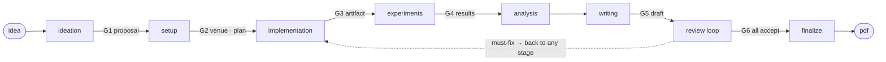

```
> /paper-generator:paper a gossip protocol that heals partitions without a coordinator

  ⚡ Skill: ideation       → paper/proposal.md          (G1 proposal)
  ⚡ Skill: setup          → venue + paper/plan.md      (G2 plan)
  ⚡ Skill: implementation → paper/src/                 (G3 artifact)
  ⚡ Skill: experiments    → paper/experiments/*.csv    (G4 results)
  ⚡ Skill: analysis       → paper/figures/*.pdf
  ⚡ Skill: writing        → paper/manuscript/main.tex  (G5 draft)
  ⚡ Agent: reviewer × 3   → loop until all three accept (G6)
  ⚡ Skill: finalize       → camera-ready PDF
✓ paper/manuscript/main.pdf, all three reviewers at accept
```

# paper-generator

> Turn a raw research idea into a submitted paper, with three simulated reviewers standing between your draft and the deadline.

`research` · `latex` · `peer-review` · `pipeline`

[](https://github.com/zyx1121/paper-generator) &nbsp;[](.claude-plugin/plugin.json) &nbsp;[](#license)

Writing a paper end to end means playing a dozen roles at once: idea whisperer, experiment engineer, LaTeX typesetter, and your own harshest reviewer. This plugin plays all of them, but refuses to shortcut the part that matters: every number in the draft has to trace back to a real experiment run, and every draft has to survive a simulated program committee before it counts as done.

## Install

```
/plugin marketplace add zyx1121/paper-generator
/plugin install paper-generator@paper-generator
```

> [!NOTE]
> Needs **Python 3.9+** (`python3` on PATH, runs the bundled MCP server) and a
> LaTeX toolchain (`latexmk` from TeX Live, or `tectonic`); the pipeline checks
> and tells you what's missing. `matplotlib` for whatever Python your figure
> scripts use. Optional `S2_API_KEY` (free, from
> [semanticscholar.org/product/api](https://www.semanticscholar.org/product/api))
> for richer `scholar_search` metadata; without it, results fall back to OpenAlex.

Start with `/paper-generator:paper <your idea>` and talk it through. State persists
in `paper/STATE.md`, so running the command with no arguments in a later session
resumes where you left off. Every stage is also a standalone skill under the
`paper-generator:` prefix: `ideation`, `setup`, `implementation`, `experiments`,
`analysis`, `writing`, `review` (mock-review any draft), `finalize`.

## What it gives you

| Component | What it does |
|---|---|
| `skills/paper` | Orchestrator: drives all 8 stages, the gates, the `paper/STATE.md` protocol |
| `skills/ideation` … `skills/finalize` | One skill per stage, each usable standalone |
| `agents/reviewer` | Simulated PC reviewer: 3 personas (domain expert, methods hawk, informed outsider), structured review form |
| `agents/copyeditor` | In-place prose editor that enforces the style rulebook without touching technical content |
| `mcp/paper_tools.py` | Zero-dependency MCP server: `latex_compile` · `render_figure` · `arxiv_search` · `scholar_search` · `dblp_bibtex` |

## Pipeline



Gates are hard stops: irreversible or judgment calls (proposal, venue + plan,
implementation, results, draft, final sign-off) come to you with a
recommendation attached. Everything between gates runs autonomously, and a
must-fix from the review loop can send the pipeline back to any earlier stage.

## Principles baked in

- **No fabricated data, ever.** Every number in the paper traces to a real run under `paper/experiments/`, with per-run provenance (command, config, seed, environment, commit hash). No user override.
- **Claims are refutable.** Contributions are written as checkable claims, each forward-referenced to the evidence that substantiates it, and the review loop attacks exactly that mapping.

## Contributing

Issues and PRs welcome: ground rules in [CONTRIBUTING.md](https://github.com/zyx1121/.github/blob/main/CONTRIBUTING.md).

## License

[MIT](LICENSE) · the one section that skips peer review
